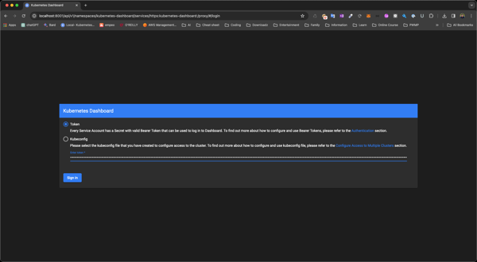

## Deploy Kubernetest Dashboard

Deploy kuebernetes dashboard with

```bash
kubectl config use-context k3d-<cluster-name>
```
```bash
kubectl apply -f https://raw.githubusercontent.com/kubernetes/dashboard/v2.7.0/aio/deploy/recommended.yaml
```

Now we need create a dashboard account and bind this account to cluster-admin-role

```bash
kubectl apply -f user-role.yml
```

after create this user get user token with

```bash
kubectl -n kubernetes-dashboard create token admin-user
```

Now execute

```bash
kubectl proxy
```
Open URL: [Dashboard login](http://localhost:8001/api/v1/namespaces/kubernetes-dashboard/services/https:kubernetes-dashboard:/proxy/#/login)

and use Token to login


