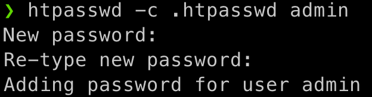
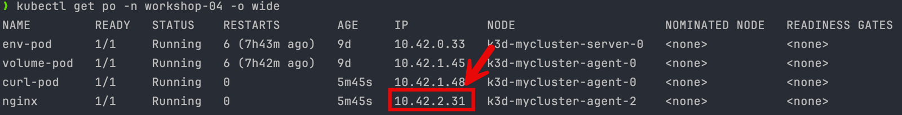

## Managing Application Configuration

1. namespace and config map

    ```bash
    kubectl create -f 00-namespace.yml
    ```
    ```bash
    kubectl create -f 01-config-map.yml
    ```
    ```bash
    kubectl get configmap -A
    ```
    ```bash
    kubectl describe configmap/my-configmap -n workshop-04 
    ```

2. Secret

    [Convert plain text to base64](https://www.base64encode.org/)
   
    key1: secret

    key2: anothersecret
   
   ```bash
   kubectl create -f 02-secret.yml
   ```
   ```bash
   kubectl get secret -A
   ```
   ```bash
   kubectl describe secret/my-secret -n workshop-04 
   ``` 

3. Use in Environment Pod

   ```bash
   kubectl apply -f 03-environment-variable.yml
   ```
   ```bash
   kubectl get po -o wide -n workshop-04 
   ```
   ```bash
   kubectl logs po/env-pod -n workshop-04
   ```   

4. Use with file

   ```bash
   kubectl apply -f 04-volume-pod.yml
   ```
   ```bash
   kubectl get po -o wide -n workshop-04 
   ```
   ```bash
   kubectl exec po/volume-pod -n workshop-04 -c busybox -- ls /etc/config/configmap
   ```   
   ```bash
   kubectl exec po/volume-pod -n workshop-04 -c busybox -- cat /etc/config/configmap/key1
   ``` 
   ```bash
   kubectl exec po/volume-pod -n workshop-04 -c busybox -- cat /etc/config/configmap/key2
   ``` 
   ```bash
   kubectl exec po/volume-pod -n workshop-04 -c busybox -- cat /etc/config/configmap/key3
   ``` 
   ```bash
   kubectl exec po/volume-pod -n workshop-04 -c busybox -- ls /etc/config/secret
   ```
   ```bash
   kubectl exec po/volume-pod -n workshop-04 -c busybox -- cat /etc/config/secret/secretkey1
   ```    
   ```bash
   kubectl exec po/volume-pod -n workshop-04 -c busybox -- cat /etc/config/secret/secretkey2
   ```

5. nginx Webserver configuration and password
   
   create .htpasswd

   - user: admin

   - password: pwd123!

   ***example***

   
   
   ```bash
   kubectl create secret generic nginx-htpasswd -n workshop-04 --from-file .htpasswd
   ```
   ```bash
   kubectl get secret -n workshop-04
   ```
   ```bash
   kubectl describe secret/nginx-htpasswd -n workshop-04
   ```
   ```bash
   kubectl apply -f 05-nginx-pod.yml
   ```
   ```bash
   kubectl get po -n workshop-04 -o wide
   ```
   *check ip and use in this command

   

   ```bash
    kubectl exec curl-pod -n workshop-04 -- curl <nginx pod ip>
   ```

   ```bash
    kubectl exec curl-pod -n workshop-04 -- curl -u admin:pwd123! <nginx pod ip>
   ```

6. Remove all Pod and namespace

   ```bash
   kubectl delete ns/workshop-04
   ```
   
   ```bash
   kubectl get po -A
   ```