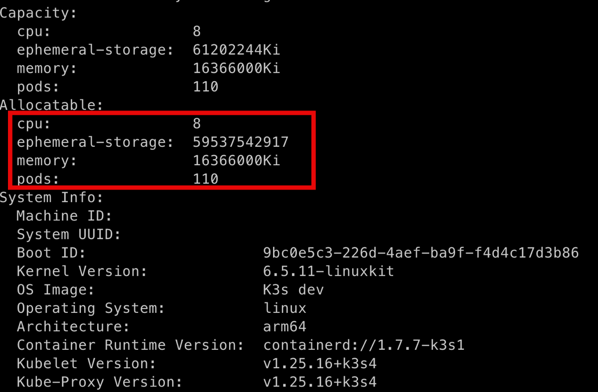
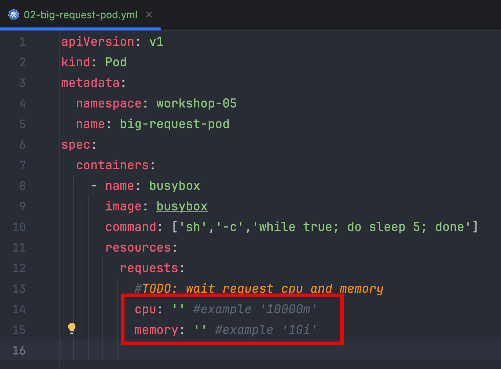

## Managing Container Resources

1. Inspecting Pod Resource Usage

   ```bash
   kubectl get deploy -n kube-system
   ```
   ```bash
   kubectl get --raw /apis/metrics.k8s.io
   ```
   ```bash
   kubectl apply -f 00-namespace.yml
   ```
   ```bash
   kubectl apply -f 01-metrics-test.yml
   ```
   ```bash
   kubectl top po --sort-by=cpu -A --sum=true
   ```
   ```bash
   kubectl top po -A --selector app=metrics-test
   ```
   ```bash
   kubectl top no
   ```   
      
2. Manage Container Resource

   ```bash
   kubectl get no  
   ```
   ```bash
   kubectl describe no/k3d-mycluster-agent-0
   ```
   Check node allocatable
   
   
   Modify 02-big-request-pod.yml greater than node allocate
   

   ```bash
   kubectl apply -f 02-big-request-pod.yml
   ```
   ```bash
   kubectl get po -n workshop-05
   ```
   ```bash
   kubectl describe po/big-request-pod -n workshop-05
   ```
   ```bash
   kubectl apply -f 03-resource-pod.yml
   ```
   ```bash
   kubectl describe po/resource-pod -n workshop-05
   ```   
   
3. Monitoring Container Health with Probes

   ```bash
   kubectl apply -f 04-liveness-pod.yml
   ```
   ```bash
   kubectl get po -o wide -n workshop-05
   ```
   ```bash
   kubectl apply -f 05-liveness-pod-http.yml
   ```
   ```bash
   kubectl get po -o wide -n workshop-05
   ```   
   ```bash
   kubectl apply -f 06-startup-pod.yml
   ```
   ```bash
   kubectl get po -o wide -n workshop-05
   ```
   ```bash
   kubectl apply -f 07-readiness-pod.yml
   ```
   ```bash
   kubectl get po -o wide -n workshop-05
   ```
   
4. Remove all Pod and namespace

   ```bash
   kubectl delete ns/workshop-05
   ```
   ```bash
   kubectl get po -A
   ```