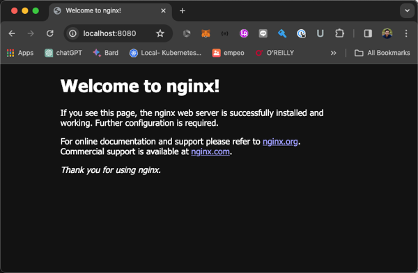

## Service and Ingress
1. Create workshop namespace and walk through DNS workshop

   ```bash
   kubectl apply -f 00-namespace.yml
   ```
   ```bash
   kubectl apply -f 01-dnstest.yml
   ```
   ```bash
   kubectl get po -o wide -n workshop-10
   ```
   ```bash
   kubectl exec netshoot -n workshop-10 -- curl <nginx-dnstest pod IP> 
   ```
   Check coredns pod and kube-dns service in kube-system namespace
   ```bash
   kubectl get po -o wide -n kube-system
   ```
   ```bash
   kubectl get svc -n kube-system
   ```
   ```bash
   kubectl exec netshoot -n workshop-10 -- nslookup <nginx-dnstest pod IP ** change "." to "-">.default.pod.cluster.local
   ```
   ```bash
   kubectl exec netshoot -n workshop-10 -- curl <nginx-dnstest pod IP ** change "." to "-">.default.pod.cluster.local 
   ```   

2. Using K8s Services

   ```bash
   kubectl apply -f 02-frontend-app.yml
   ```
   ```bash
   kubectl get po -o wide -n workshop-10
   ```
   ```bash
   kubectl apply -f 03-svc-clusterip.yml
   ```
   ```bash
   kubectl get svc -o wide -n workshop-10
   ```
   ```bash
   kubectl get endpoints -n workshop-10
   ```
   ```bash
    kubectl exec netshoot -n workshop-10 -- curl svc-clusterip
   ```
   ```bash
   kubectl apply -f 04-svc-nodeport.yml
   ```
   ```bash
   kubectl get svc -o wide -n workshop-10
   ```
   ```bash
   kubectl get endpoints -n workshop-10
   ```   
   ```bash
   docker network ls
   ```
   ```bash
   kubectl get no -o wide
   ``` 
   ```bash
   docker run --rm --network=<k3d network ex. k3d-mycluster> -it nicolaka/netshoot curl <node IP>:<nodeport>
   ```
   ```bash
   kubectl apply -f 05-svc-external.yml
   ```
   ```bash
   kubectl get svc -o wide -n workshop-10
   ```
   ```bash
   kubectl exec netshoot -n workshop-10 -- nslookup chula-hospital
   ```

3. Ingress
   ```bash
   kubectl apply -f 06-my-ingress.yml
   ```
   ```bash
   kubectl describe ingress/my-ingress -n workshop-10
   ```

   Goto browser and access http://localhost:8080

   

4. Remove all

   ```bash
   kubectl delete -f 00-namespace.yml
   ```
   ```bash
   kubectl get po -A
   ```